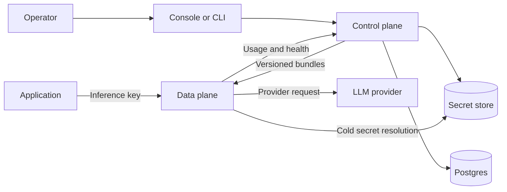

<div align="center">
  <h1><code>airmux</code></h1>
  <p><strong>One self-hosted LLM gateway. Any compatible client. Multiple providers.</strong></p>
  <p>
    Connect through a supported inference API while `airmux` centralizes provider translation, routing, policy,
    credentials, failover, and usage accounting behind one endpoint.
  </p>
  <p>
    <a href="https://github.com/michel-tricot/airmux/actions/workflows/ci.yml"></a>
    <a href="https://pypi.org/project/airmux/"></a>
    <a href="https://www.python.org/downloads/"></a>
    <a href="LICENSE"></a>
  </p>
  <p>
    <a href="#quickstart">Quickstart</a> ·
    <a href="docs/index.mdx">Documentation</a> ·
    <a href="CONTRIBUTING.md">Contributing</a> ·
    <a href="https://github.com/michel-tricot/airmux/issues/new">Report a bug</a>
  </p>
</div>

`airmux` gives applications, agents, CLIs, and services one self-hosted origin for calling multiple provider families.
Clients send Chat Completions, Responses, or Messages requests through any SDK or integration that can target the
corresponding HTTP API. `airmux` authenticates the workspace, applies policy, selects a model and scoped provider
credential, translates the request, and records the result.

You run the whole platform: a web console, organizations and workspaces, managed provider credentials, live policy, and
persistent usage history with estimated cost.

> [!NOTE]
> `airmux` is pre-1.0. Configuration, APIs, and migrations may change before the first stable release.

## Quickstart

Run the full platform on one machine. You need Docker with Compose 2.24.4+ and an API key for at least one provider.

```bash
curl -fsSLO https://github.com/michel-tricot/airmux/releases/latest/download/docker-compose.yml
mkdir -p airmux-config
docker compose up -d --wait
docker compose exec cli airmux quickstart --url http://localhost:8080
```

Enter a provider key when prompted. `quickstart` sets up your account and workspace, prints an inference key, and sends
a real model request. Open [localhost:8080](http://localhost:8080) for the console, where the request appears with its
model, tokens, and estimated cost.

> [!NOTE]
> Requests through `airmux` call real providers and are billed by them.

The [quickstart guide](docs/quickstart.mdx) continues through finding that request in the console. See
[customize the Docker deployment](docs/deployment/docker.mdx#customize-the-runtime-yaml) when you need to change runtime settings.

| Goal | Command |
| --- | --- |
| List catalog models | `docker compose exec cli airmux models list` |
| Inspect the installation | `docker compose exec cli airmux doctor` |
| Follow gateway activity | `docker compose exec cli airmux events tail --interval 2 --keep 30` |
| Follow service logs | `docker compose logs -f cli` |
| Stop while preserving state | `docker compose down` |

## Use your existing client

Any client that can target one of `airmux`'s HTTP APIs and send an inference key through `Authorization: Bearer` or
`x-api-key` can connect. That includes SDKs, agent frameworks, CLIs, services, and raw HTTP integrations.

| API | Endpoint |
| --- | --- |
| Chat Completions | `POST /inf/v1/chat/completions` |
| Responses | `POST /inf/v1/responses` |
| Messages | `POST /inf/v1/messages` |
| Model discovery | `GET /inf/v1/models` and `GET /inf/v1/models/{model_id}` |

The OpenAI SDK is one example. Point it at `/inf/v1` and replace the upstream key with an `airmux` inference key:

```python
import os

from openai import OpenAI

client = OpenAI(
    base_url="http://127.0.0.1:8080/inf/v1",
    api_key=os.environ["AIRMUX_INFERENCE_KEY"],
)

response = client.chat.completions.create(
    model="openai/gpt-4o-mini",
    messages=[{"role": "user", "content": "Why use an LLM gateway?"}],
)

print(response.choices[0].message.content)
```

The client protocol does not constrain the provider route. A Messages request can target an OpenAI-compatible model,
and a Chat Completions request can target an Anthropic model. `airmux` translates the request and returns the response
and errors in the caller's dialect. See the [SDK guide](docs/guides/sdks.mdx) for client examples.

## Why `airmux`

- **Protocol-first clients:** connect any SDK, agent framework, CLI, service, or raw HTTP integration that speaks an exposed API
- **Policy at the gateway:** compose model and provider allowlists, price ceilings, spending budgets, request limits, credential rules, denials, strict parameters, and fallbacks
- **Scoped provider secrets:** separate instance, organization, and workspace credentials without exposing secret values to configuration bundles
- **Predictable failover:** retry eligible credentials and route to bounded backup models without escaping workspace policy
- **Complete request records:** capture tokens, estimated cost, latency, status, credential scope, configuration version, and every fallback attempt
- **A resilient request path:** gateways evaluate immutable local bundles and can keep serving through a control-plane outage

The provider catalog includes Anthropic, AWS Bedrock, Azure OpenAI, Cerebras, DeepSeek, Fireworks, Groq, Mistral, OpenAI,
Together, and xAI. Its model IDs, prices, context windows, modalities, capabilities, and parameter support are explicit,
inspectable data in the [taxonomy](taxonomy/taxonomy.yml). Bedrock includes GPT-5.6 Terra through the regional Bedrock
Mantle endpoint. Azure OpenAI is a resource template: replace `RESOURCE` with your Azure resource name and configure
the upstream model ID to match your deployment name.

## Gateway-only mode

A secondary path for one inference endpoint managed through local files, with no Docker, Postgres, console, or usage
history. You need Python 3.13+, uv, and a provider key:

```bash
uv tool install airmux
export OPENAI_API_KEY='your-provider-key'
airmux gateway init
airmux gateway serve
```

`init` creates configuration, a model taxonomy, and a private inference key under `.airmux/`. Continue with the
[gateway-only guide](docs/deployment/gateway.mdx).

## Architecture

`airmux` separates mutable management work from the inference request path.



Caller dialects and provider protocols cross through one canonical model, so adding a caller dialect costs one ingress
adapter and adding a provider family costs one egress adapter. The control plane compiles complete, versioned
organization bundles that gateways validate and adopt atomically, so inference never reads the management database and
an in-flight request never observes partially updated policy.

Read the [architecture guide](docs/concepts/architecture.mdx) for the full data flow, failure boundaries, and deployment
shapes.

## Documentation

| I want to... | Start here |
| --- | --- |
| Run `airmux` and see it working | [Quickstart](docs/quickstart.mdx) |
| Connect an application | [Use an SDK](docs/guides/sdks.mdx) |
| Control routing, access, and spending | [Workspace policies](docs/guides/policies.mdx) |
| Understand usage and cost | [Usage and activity](docs/features/usage.mdx) |
| Deploy `airmux` | [Deployment overview](docs/deployment/index.mdx) |
| Deploy without Docker | [Linux host deployment](docs/deployment/without-docker.mdx) |
| Customize a Docker deployment | [Docker Compose](docs/deployment/docker.mdx#customize-the-runtime-yaml) |
| Upgrade or roll back a deployment | [Docker Compose](docs/deployment/docker.mdx#upgrade-and-roll-back), [without Docker](docs/deployment/without-docker.mdx#upgrade-and-roll-back), or [separate services](docs/deployment/scaling.mdx#upgrade-and-roll-back) |
| Call the management API | [Management API](docs/reference/management-api.mdx) |
| Work on the project | [Contributing](CONTRIBUTING.md) and [Development guide](docs/development.mdx) |

The complete management API is generated from [`lib/api-spec/openapi.yaml`](lib/api-spec/openapi.yaml).
