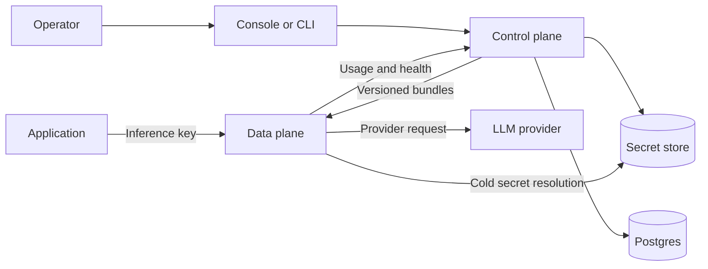

<div align="center">
  <h1>airmux</h1>
  <p><strong>One self-hosted LLM gateway. Any compatible client. Multiple providers.</strong></p>
  <p>
    Connect through a supported inference API while airmux centralizes provider translation, routing, policy,
    credentials, failover, and usage accounting behind one endpoint.
  </p>
  <p>
    <a href="https://github.com/michel-tricot/airmux/actions/workflows/ci.yml"></a>
    <a href="https://pypi.org/project/airmux/"></a>
    <a href="https://www.python.org/downloads/"></a>
    <a href="LICENSE"></a>
  </p>
  <p>
    <a href="#quickstart">Quickstart</a> ·
    <a href="docs/index.mdx">Documentation</a> ·
    <a href="CONTRIBUTING.md">Contributing</a> ·
    <a href="https://github.com/michel-tricot/airmux/issues/new">Report a bug</a>
  </p>
</div>

airmux gives applications, agents, CLIs, and services one self-hosted origin for calling multiple provider families.
Clients can send Chat Completions, Responses, Messages, or canonical requests through any SDK or integration that can
target the corresponding HTTP API. airmux authenticates the workspace, applies policy, selects a model and scoped
provider credential, translates the request, and records the result.

## Quickstart

Run a local gateway with no Docker, Postgres, or control plane. You need Python 3.13+, [uv](https://docs.astral.sh/uv/),
and an OpenAI API key.

### 1. Install and start the gateway

```bash
uv tool install airmux
mkdir airmux-demo
cd airmux-demo
export OPENAI_API_KEY='your-provider-key'
airmux gateway init
airmux gateway serve
```

`init` creates a local configuration, a model taxonomy, and a private inference key under `.airmux/`. The gateway
reads provider credentials from the environment and reloads taxonomy edits while it runs.

### 2. Make a real model request

In another terminal:

```bash
cd airmux-demo
export AIRMUX_INFERENCE_KEY="$(cat .airmux/inference.key)"
curl --fail-with-body http://127.0.0.1:8080/inf/v1/chat/completions \
  -H "Authorization: Bearer $AIRMUX_INFERENCE_KEY" \
  -H 'Content-Type: application/json' \
  -d '{"model":"openai/gpt-4o-mini","messages":[{"role":"user","content":"Reply with exactly: airmux ready"}],"max_completion_tokens":16}'
```

The same gateway accepts streaming requests, tool calls, structured output, reasoning, images, and PDF inputs when the
selected model supports them. Continue with the [gateway-only guide](docs/deployment/gateway.mdx) for configuration and
operation.

## Use your existing client

Any client that can target one of airmux's exposed HTTP APIs and send an inference key through
`Authorization: Bearer` or `x-api-key` can connect. That includes SDKs,
agent frameworks, CLIs, services, and raw HTTP integrations.

| API | Endpoint |
| --- | --- |
| Chat Completions | `POST /inf/v1/chat/completions` |
| Responses | `POST /inf/v1/responses` |
| Messages | `POST /inf/v1/messages` |
| Model discovery | `GET /inf/v1/models` and `GET /inf/v1/models/{model_id}` |
| Canonical | `POST /inf/v1/chat/completions` with `x-airmux-dialect: canonical` |

The OpenAI SDK is one example. Point it at `/inf/v1` and replace the upstream key with an airmux inference key:

```python
import os

from openai import OpenAI

client = OpenAI(
    base_url="http://127.0.0.1:8080/inf/v1",
    api_key=os.environ["AIRMUX_INFERENCE_KEY"],
)

response = client.chat.completions.create(
    model="openai/gpt-4o-mini",
    messages=[{"role": "user", "content": "Why use an LLM gateway?"}],
)

print(response.choices[0].message.content)
```

The client protocol does not constrain the provider route. A Messages request can target an OpenAI-compatible model,
and a Chat Completions request can target an Anthropic model. airmux translates the request and returns the response
and errors in the caller's dialect. See the [OpenAI SDK](docs/guides/openai-sdk.mdx) and
[Anthropic SDK](docs/guides/anthropic-sdk.mdx) guides for complete examples, including streaming.

## Why airmux

- **Protocol-first clients:** connect any SDK, agent framework, CLI, service, or raw HTTP integration that speaks an exposed API
- **Policy at the gateway:** compose model and provider allowlists, price ceilings, request limits, credential rules, denials, strict parameters, and fallbacks
- **Scoped provider secrets:** separate instance, organization, and workspace credentials without exposing secret values to configuration bundles
- **Predictable failover:** retry eligible credentials and route to bounded backup models without escaping workspace policy
- **Complete request records:** capture tokens, cost, latency, status, credential scope, configuration version, and every fallback attempt
- **A resilient request path:** gateways evaluate immutable local bundles and can keep serving through a control-plane outage

The shipped catalog includes Anthropic, Cerebras, DeepSeek, Fireworks, Groq, Mistral, OpenAI, Together, and xAI. Model
IDs, prices, context windows, modalities, capabilities, and parameter support are explicit, inspectable data in the
[taxonomy](taxonomy/taxonomy.yml).

## Full-platform quickstart

Use the complete stack when you want the web console, organizations and workspaces, managed credentials, live policy,
usage history, and audit activity. You need Docker with Compose 2.24.4+, Python 3.13+, uv, and at least one provider API
key.

```bash
git clone https://github.com/michel-tricot/airmux.git
cd airmux
cp .env.example .env
```

Add a provider key such as `OPENAI_API_KEY` or `ANTHROPIC_API_KEY` to `.env`, then run:

```bash
uv tool install airmux
docker compose up -d --build --wait
airmux quickstart --url http://localhost:8080
```

`quickstart` creates or resumes the owner account, organization, and workspace; imports missing provider credentials;
mints an inference key; and proves the installation with a real model request. Open
[localhost:8080](http://localhost:8080) for the console.

| Goal | Command |
| --- | --- |
| List catalog models | `airmux models list` |
| Inspect the installation | `airmux doctor` |
| Follow gateway activity | `airmux events tail --interval 2 --keep 30` |
| Follow service logs | `docker compose logs -f airmux` |
| Stop while preserving state | `docker compose down` |

## Architecture

airmux separates mutable management work from the inference request path.



Caller dialects and provider protocols cross through one canonical model. Adding a caller dialect requires one ingress
adapter; adding a provider family requires one egress adapter. Policy, routing, streaming, and metering stay
provider-neutral instead of multiplying into a translator for every caller and provider pair.

The control plane compiles complete, versioned organization bundles. Data-plane workers validate them, build immutable
indexes, and atomically adopt them. Inference therefore avoids management database reads and an in-flight request never
observes partially updated policy. Cold provider-secret resolution is the only database-capable exception, and secret
values never enter a bundle.

Read the [architecture guide](docs/concepts/architecture.mdx) for the full data flow, failure boundaries, and deployment
shapes.

## Documentation

| I want to... | Start here |
| --- | --- |
| Try the complete stack | [Quickstart](docs/quickstart.mdx) |
| Connect an application | [OpenAI SDK](docs/guides/openai-sdk.mdx) or [Anthropic SDK](docs/guides/anthropic-sdk.mdx) |
| Add routing and access rules | [Policy workflow](docs/guides/policy-workflow.mdx) |
| Understand supported inference shapes | [Inference reference](docs/reference/inference.mdx) |
| Deploy airmux | [Deployment overview](docs/deployment/index.mdx) |
| Call the management API | [Management API](docs/reference/management-api.mdx) |
| Work on the project | [Development guide](docs/development.mdx) |

The complete management API is generated from [`lib/api-spec/openapi.yaml`](lib/api-spec/openapi.yaml).

## Contributing and support

Contributions are welcome. Read [Contributing](CONTRIBUTING.md) for the development workflow, architectural boundaries,
generated contracts, and validation expectations. Significant design changes should update the relevant record in
[`notes/design`](notes/design/README.md).

Use [GitHub Issues](https://github.com/michel-tricot/airmux/issues) to report a bug or propose a focused feature.

## License and project status

airmux is pre-1.0. APIs, configuration, and migrations may change before the first stable release. The project is
licensed under the [Elastic License 2.0](LICENSE).
