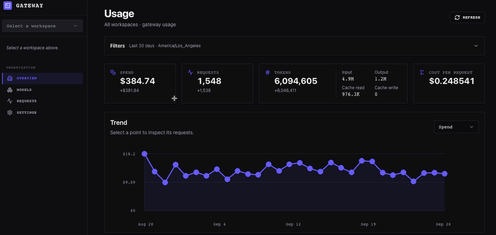
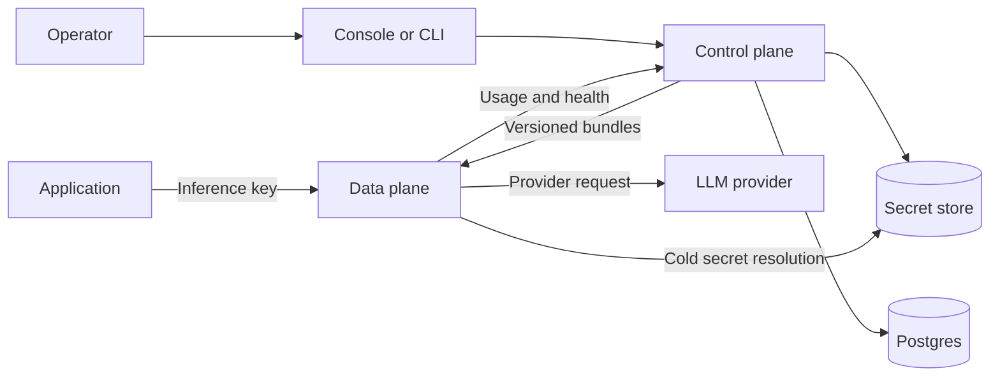

# `airmux`

`airmux` is a self-hosted gateway between your app and its LLM providers. Change the client's base URL and API key;
keep using Chat Completions, Responses, or Messages.

<div align="center">
  <p>
    <a href="https://github.com/michel-tricot/airmux/actions/workflows/ci.yml"></a>
    <a href="https://pypi.org/project/airmux/"></a>
    <a href="https://www.python.org/downloads/"></a>
    <a href="LICENSE"></a>
  </p>
  <p>
    <a href="#quickstart">Quickstart</a> ·
    <a href="docs/index.mdx">Documentation</a> ·
    <a href="CONTRIBUTING.md">Contributing</a> ·
    <a href="https://github.com/michel-tricot/airmux/issues/new">Report a bug</a>
  </p>
</div>



*Example organization usage in the webapp, using synthetic data*

For each request, `airmux` applies workspace policy, picks a provider credential, calls the model, and records tokens and cost.
It replies in the caller's API format.

> [!NOTE]
> `airmux` is pre-1.0. Configuration, APIs, and migrations may change before the first stable release.

## Quickstart

Run the full platform on one node. You need Docker with Compose 2.24.4+ and an API key for at least one provider.

```bash
curl -fsSLO https://github.com/michel-tricot/airmux/releases/latest/download/docker-compose.yml
docker compose up -d --wait
```

Open [localhost:8080](http://localhost:8080) and follow the setup steps. Then create a workspace and try **Playground**.

Or use the CLI:

```bash
docker compose exec app airmux quickstart --url http://localhost:8080
```

`quickstart` sets up your account and workspace, prints an inference key, and sends a real model request.
Open [localhost:8080](http://localhost:8080) for the console, where the request appears with its model, tokens, and estimated cost.

### Send an API request

Copy the key printed by the CLI. If you used the web app, create one under **Inference Keys** in your workspace.
The example uses an OpenAI model. If you configured another provider, use one of its model IDs from the web app's
**Models** page or the model reported by `quickstart`.

```bash
export AIRMUX_INFERENCE_KEY='sk-inf-your-key'
curl --fail-with-body http://localhost:8080/inf/v1/chat/completions \
  -H "Authorization: Bearer $AIRMUX_INFERENCE_KEY" \
  -H 'Content-Type: application/json' \
  -d '{"model":"openai/gpt-4o-mini","messages":[{"role":"user","content":"Say hello in five words"}],"max_completion_tokens":64}'
```

A successful response contains the answer in `choices[0].message.content` and token counts in `usage`.
The request then appears under **Requests** in the web app. It calls your provider and is billed by that provider.

## Use your existing client

Any client that can target one of `airmux`'s HTTP APIs and send an inference key through `Authorization: Bearer` or `x-api-key` can connect. That includes SDKs, agent frameworks, CLIs, services, and raw HTTP integrations.

| API | Endpoint |
| --- | --- |
| Chat Completions | `POST /inf/v1/chat/completions` |
| Responses | `POST /inf/v1/responses` |
| Messages | `POST /inf/v1/messages` |
| Model discovery | `GET /inf/v1/models` and `GET /inf/v1/models/{model_id}` |

For example, the OpenAI SDK just needs to be pointed it at `/inf/v1` with an `airmux` inference key:

```python
import os

from openai import OpenAI

client = OpenAI(
    base_url="http://127.0.0.1:8080/inf/v1",
    api_key=os.environ["AIRMUX_INFERENCE_KEY"],
)

response = client.chat.completions.create(
    model="openai/gpt-4o-mini",
    messages=[{"role": "user", "content": "Why use an LLM gateway?"}],
)

print(response.choices[0].message.content)
```

A `Messages` request can target an OpenAI-compatible model, and a `Chat Completions` request can target a `Messages` model. `airmux` translates the request and returns the response and errors in the caller's dialect. See the [SDK guide](docs/guides/sdks.mdx) for client examples.

## Why `airmux`

- **Protocol-first clients:** connect any SDK, agent framework, CLI, service, or raw HTTP integration
- **Policy at the gateway:** compose model and provider allowlists, price ceilings, spending budgets, request limits, credential rules, denials, strict parameters, and fallbacks
- **Full feature translation:** translate buffered and streaming requests, including tool calls, structured output, reasoning, images, and PDF inputs when the selected model supports them
- **Inference keys governance:** virtualize and monitor inference keys for organizations, workspaces, users or specific agents
- **Agent ready management:** manage the configurations with your agent through the CLI and service accounts
- **Predictable failover:** retry eligible credentials and route to bounded backup models without escaping workspace policy
- **Outage-tolerant gateways:** keep serving inference during a control-plane outage
- **Complete request records:** capture tokens, cost, latency, status, credential scope, and every fallback attempt
- **Self-hosted platform:** run the webapp, organizations and workspaces, live policy, and persistent usage history on your own infrastructure
- **Built-in observability:** export operational metrics through OpenTelemetry (OTLP) or scrape with Prometheus

The shipped catalog includes 9 providers and 243 models across OpenAI, Anthropic, Cerebras, DeepSeek, Fireworks, Groq, Mistral, Together, and xAI. Model IDs, prices, context windows, modalities, capabilities, and parameter support are explicit, inspectable data in the [taxonomy](taxonomy/taxonomy.yml).

## Gateway-only mode

A secondary path for one inference endpoint managed through local files, with no Docker, Postgres, console, or usage history. You need Python 3.13+, uv, and a provider key:

```bash
uv tool install airmux
export OPENAI_API_KEY='your-provider-key'
airmux gateway init
airmux gateway serve
```

`init` creates configuration, a model taxonomy, and a private inference key under `.airmux/`. Continue with the [gateway-only guide](docs/deployment/gateway.mdx).

## Architecture

`airmux` separates mutable management work from the inference request path.


```mermaid
flowchart LR
  A[Application] -->|Inference key| G[Data plane]
  U[Operator] --> C[Console or CLI]
  C --> M[Control plane]
  M --> P[(Postgres)]
  M --> S[(Secret store)]
  M -->|Versioned bundles| G
  G -->|Cold secret resolution| S
  G -->|Provider request| L[LLM provider]
  G -->|Usage and health| M
```

Caller dialects and provider protocols cross through one canonical model, so adding a caller dialect costs one ingress adapter and adding a provider family costs one egress adapter.

Read the [architecture guide](docs/concepts/architecture.mdx) for the full data flow, failure boundaries, and deployment shapes.

## Documentation

| I want to... | Start here |
| --- | --- |
| Run `airmux` and see it working | [Quickstart](docs/quickstart.mdx) |
| Connect an application | [Use an SDK](docs/guides/sdks.mdx) |
| Control routing, access, and spending | [Workspace policies](docs/guides/policies.mdx) |
| Understand usage and cost | [Usage and activity](docs/features/usage.mdx) |
| Deploy `airmux` | [Deployment overview](docs/deployment/index.mdx) |
| Deploy without Docker | [Linux host deployment](docs/deployment/without-docker.mdx) |
| Customize a Docker deployment | [Docker Compose](docs/deployment/docker.mdx#customize-the-runtime-yaml) |
| Upgrade or roll back a deployment | [Docker Compose](docs/deployment/docker.mdx#upgrade-and-roll-back), [without Docker](docs/deployment/without-docker.mdx#upgrade-and-roll-back), or [separate services](docs/deployment/scaling.mdx#upgrade-and-roll-back) |
| Call the management API | [Management API](docs/reference/management-api.mdx) |
| Work on the project | [Contributing](CONTRIBUTING.md) and [Development guide](docs/development.mdx) |

The complete management API is generated from [`lib/api-spec/openapi.yaml`](lib/api-spec/openapi.yaml).
