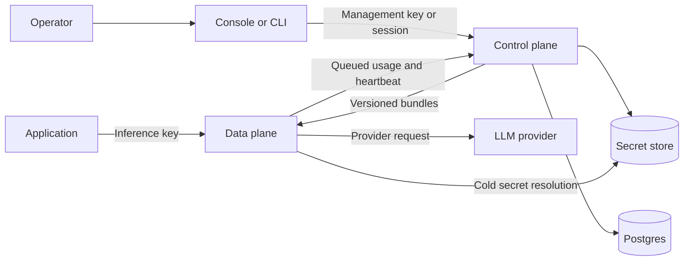
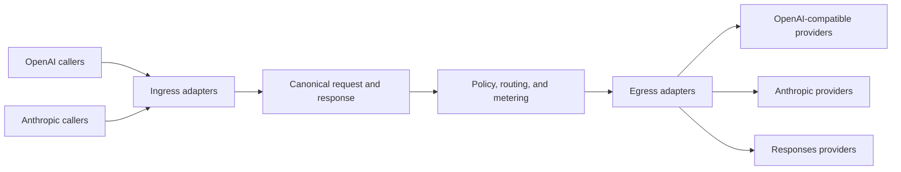

airmux separates management work from the inference request path.

## Why the planes are separate

Management operations need transactions, durable state, audit attribution, and secret writes. Inference needs a small,
predictable path that can keep serving while the management service is unavailable. The control plane therefore compiles
versioned organization bundles, and each data-plane worker validates a bundle before atomically replacing its in-memory
indexes.

A request captures one bundle snapshot and uses it for its entire lifetime. Management changes take effect only after a
new bundle is admitted, so an in-flight request never observes a partially updated policy or catalog. Features that need
management state on the request path must add that state to the bundle. Cold provider-secret resolution is the only
database-capable exception, and resolved values remain outside the bundle.

## Canonical adapter waist

With `N` caller dialects and `M` provider families, the canonical waist needs `N + M` translators rather than a
translator for every caller-provider pair. Request reconciliation, policy, routing, adjustments, usage, and cancellation
accounting are implemented once against canonical types.

Each ingress adapter owns one public path, parses that protocol into canonical, and renders canonical output for the
caller. Egress adapters translate canonical requests to a provider family and fold buffered or streaming output back
into canonical. Adapter modules are discovered automatically, so adding a dialect or provider family does not require
editing a central registry or application route list.

## Control plane

The control plane owns organizations, workspaces, users, roles, management keys, inference keys, provider-credential
metadata, policies, the model catalog, configuration bundles, usage ingestion, and audit activity. It persists
management state in Postgres.

The console and CLI are clients of the same `/api/v1` management API. Successful responses use a single `{"data": ...}` envelope.

## Data plane

The data plane owns `/inf/v1`, provider adapters, authentication of inference keys, policy evaluation, request
reconciliation, routing, streaming, and usage measurement.

The request path reads immutable indexes built from its current in-memory bundle. It does not query the control-plane
database. The sole cold-path exception is resolving the selected provider secret through the configured secret store.

## Shared package boundaries

`contract` is the pure interchange waist between the planes. It contains versioned bundle, event, policy, taxonomy,
identifier, and secret-reference values with validation and serialization, but no configuration loading, filesystem
access, network access, secret values, or adapters. Importing a wire type therefore cannot load process infrastructure
or a database driver.

`airmux_runtime` contains the process facilities with multiple consumers: deterministic YAML configuration loading,
private file creation, secret interfaces, and secret adapters. It is not a general shared-code bucket and cannot contain
plane-specific domain logic or import either plane.

Postgres secret storage remains available for split deployments, but its driver is an optional
`airmux-runtime[insecure-database]` dependency. Base runtime and standalone data-plane installations stay independent of
database drivers. Selecting that adapter without the extra fails during startup, before traffic is accepted.

## Configuration bundles

The control plane compiles one complete bundle per organization. A bundle contains active inference-key hashes,
providers, models, provider-credential references, and enabled policies with inline rule definitions. It never contains inference
tokens or provider secret values.

Remote gateways poll a manifest, validate new bundles, build lookup indexes, swap them atomically, and cache the
accepted set on disk. A cached bundle lets a gateway start and continue serving while the control plane is temporarily
unavailable.

## Deployment shapes

Module, process, artifact, and topology boundaries are separate decisions. The control plane and data plane remain
independent Python modules and processes with `contract` as their only shared import, but one release image contains both
runtimes, the console assets, Nginx, and the deployment scripts.

The image accepts five roles: `setup`, `control-plane`, `data-plane`, `console`, and `airmux`. Setup is finite and
owns bootstrap-key creation, forward migrations, and shipped-taxonomy application. The three serving roles perform no
deployment initialization. The default `airmux` role runs setup, then supervises one process for each serving role.

The airmux topology uses one application container and Postgres. The split topology projects the same image digest
into a one-shot setup container, one control plane, one console, and explicit gateway replicas. Each gateway owns a
distinct persistent cache, identity, and usage outbox. Gateway-only deployments use the same Python distribution or image
with a local bundle and need neither Postgres nor a control plane.

See [deployment](/docs/deployment) for infrastructure requirements and [request lifecycle](/docs/concepts/request-lifecycle) for the synchronous path.
