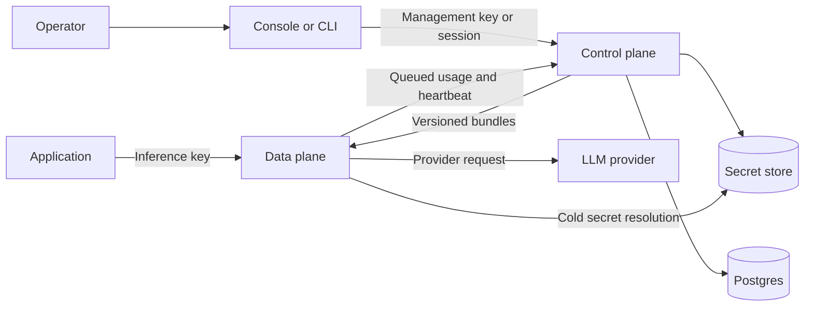

AirLLM separates management work from the inference request path.

## Control plane

The control plane owns organizations, workspaces, users, roles, management keys, inference keys, provider-credential
metadata, policies, the model catalog, configuration bundles, usage ingestion, and audit activity. It persists
management state in Postgres.

The console and CLI are clients of the same `/api/v1` management API. Successful responses use a single `{"data": ...}` envelope.

## Data plane

The data plane owns `/inf/v1`, provider adapters, authentication of inference keys, policy evaluation, request
reconciliation, routing, streaming, and usage measurement.

The request path reads immutable indexes built from its current in-memory bundle. It does not query the control-plane
database. The sole cold-path exception is resolving the selected provider secret through the configured secret store.

## Configuration bundles

The control plane compiles one complete bundle per organization. A bundle contains active inference-key hashes,
providers, models, provider-credential references, enabled policies, and referenced rules. It never contains inference
tokens or provider secret values.

Remote gateways poll a manifest, validate new bundles, build lookup indexes, swap them atomically, and cache the
accepted set on disk. A cached bundle lets a gateway start and continue serving while the control plane is temporarily
unavailable.

## Deployment shapes

The default image runs the console, control plane, and one data plane behind a single Nginx origin. Postgres runs
separately. The split image targets let operators scale or restart each service independently and give every gateway its
own persistent cache and usage outbox.

See [deployment](/docs/deployment) for infrastructure requirements and [request lifecycle](/docs/concepts/request-lifecycle) for the synchronous path.
