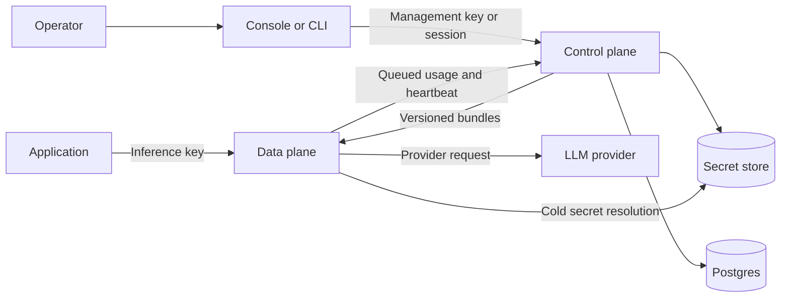
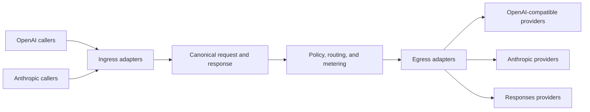

airmux separates management work from the inference request path.

## Why the planes are separate

Management operations need transactions, durable state, audit attribution, and secret writes. Inference needs a small,
predictable path that can keep serving while the management service is unavailable. The control plane therefore compiles
versioned organization bundles, and each data-plane worker validates a bundle before atomically replacing its in-memory
indexes.

A request captures one bundle snapshot and uses it for its entire lifetime. Management changes take effect only after a
new bundle is admitted, so an in-flight request never observes a partially updated policy or catalog. Features that need
management state on the request path must add that state to the bundle. Cold provider-secret resolution is the only
database-capable exception, and resolved values remain outside the bundle.

## Canonical adapter waist

With `N` caller dialects and `M` provider families, the canonical waist needs `N + M` translators rather than a
translator for every caller-provider pair. Request reconciliation, policy, routing, adjustments, usage, and cancellation
accounting are implemented once against canonical types.

Each ingress adapter owns one public path, parses that protocol into canonical, and renders canonical output for the
caller. Egress adapters translate canonical requests to a provider family and fold buffered or streaming output back
into canonical. Adapter modules are discovered automatically, so adding a dialect or provider family does not require
editing a central registry or application route list.

## Control plane

The control plane owns organizations, workspaces, users, roles, management keys, inference keys, provider-credential
metadata, policies, the model catalog, configuration bundles, usage ingestion, and audit activity. It persists
management state in Postgres.

The console and CLI are clients of the same `/api/v1` management API. Successful responses use a single `{"data": ...}` envelope.

## Data plane

The data plane owns `/inf/v1`, provider adapters, authentication of inference keys, policy evaluation, request
reconciliation, routing, streaming, and usage measurement.

The request path reads immutable indexes built from its current in-memory bundle. It does not query the control-plane
database. The sole cold-path exception is resolving the selected provider secret through the configured secret store.

## Shared package boundaries

`contract` is the pure interchange waist between the planes. It contains versioned bundle, event, policy, taxonomy,
identifier, and secret-reference values with validation and serialization, but no configuration loading, filesystem
access, network access, secret values, or adapters. Importing a wire type therefore cannot load process infrastructure
or a database driver.

`airmux_runtime` contains the process facilities with multiple consumers: deterministic YAML configuration loading,
private file creation, secret interfaces, and secret adapters. It is not a general shared-code bucket and cannot contain
plane-specific domain logic or import either plane.

Postgres secret storage remains available for split deployments, but its driver is an optional
`airmux-runtime[insecure-database]` dependency. Base runtime and standalone data-plane installations stay independent of
database drivers. Selecting that adapter without the extra fails during startup, before traffic is accepted.

## Configuration bundles

The control plane compiles one complete bundle per organization. A bundle contains active inference-key hashes,
providers, models, provider-credential references, and enabled policies with inline rule definitions. It never contains inference
tokens or provider secret values.

Management transactions do not compile bundles. They commit their configuration changes with a durable Postgres revision,
then a background publisher compiles the newest requested revision in a repeatable-read transaction. Global catalog changes
advance one instance watermark rather than updating every organization. Publishers coordinate with per-organization advisory
locks, so multiple control-plane processes can drain the same queue without publishing the same revision twice. Failed
compilations retain the last good bundle and retry with bounded backoff.

Postgres already owns the configuration transaction, so its watermarks keep the mutation and publication request atomic and
survive process loss without another queue service. Advisory locks add only cross-process coordination and release automatically
with the publication transaction.

The organization bundle status distinguishes the control plane's desired revision from its published revision. Publication is
still separate from data-plane adoption: after the control plane publishes a bundle, each remote gateway observes it on its next
manifest poll, validates it, and swaps it into memory. The console reports these as separate stages.

Remote gateways poll a manifest, validate new bundles, build lookup indexes, swap them atomically, and cache the
accepted set on disk. A cached bundle lets a gateway start and continue serving while the control plane is temporarily
unavailable.

## Deployment shapes

The default image runs the console, control plane, and one data plane behind a single Nginx origin. Postgres runs
separately. The split image targets let operators scale or restart each service independently and give every gateway its
own persistent cache and usage outbox.

See [deployment](/docs/deployment) for infrastructure requirements and [request lifecycle](/docs/concepts/request-lifecycle) for the synchronous path.
