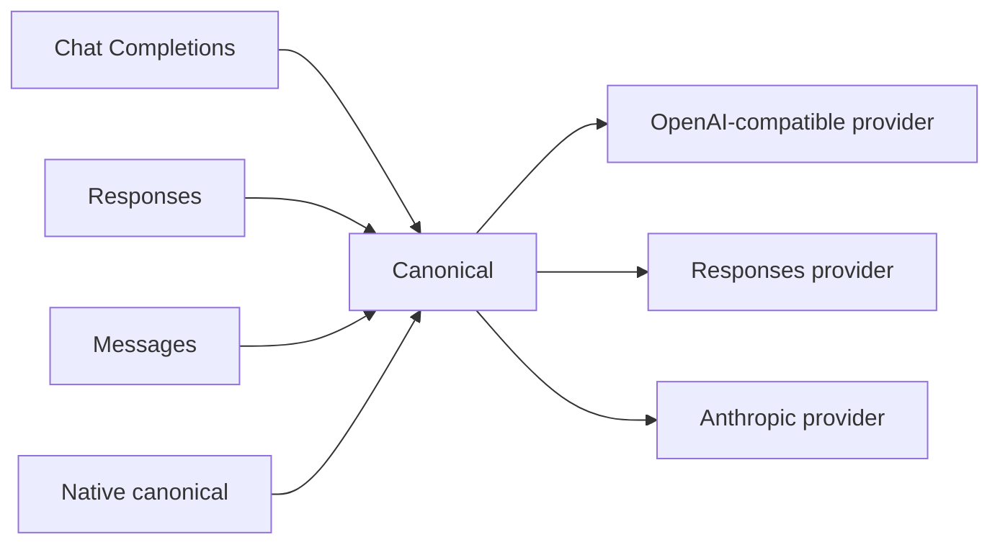

airmux uses a canonical model as the waist between callers and providers. Each ingress dialect translates into canonical
once; each provider family translates out once.

With `N` caller dialects and `M` provider families, this requires `N + M` translators. Routing, policies, capability
checks, parameter reconciliation, streaming accounting, and usage measurement operate on canonical values once.

## Typed content

Canonical messages have `system`, `user`, or `assistant` roles. Their typed parts include:

| Part | Purpose |
| --- | --- |
| `text` | Text input or output |
| `image` | URL or base64 image input |
| `document` | URL, base64 data, or provider file ID |
| `reasoning` | Reasoning text plus optional opaque identity and signature |
| `tool_call` | Tool name, call ID, and JSON argument text |
| `tool_result` | Result associated with a prior call ID |

Nested shapes are closed and reject unknown fields. The documented top level of a canonical request is open so
provider-specific parameters can travel to a compatible provider profile.

## Dialect selection

`/inf/v1/responses` and `/inf/v1/messages` bind their dialect by route. `/inf/v1/chat/completions` resolves the dialect in this order:

1. `x-airmux-dialect` override
2. Unambiguous request shape or SDK user-agent
3. Canonical as the default

Official SDK requests and unambiguous OpenAI fields such as `max_completion_tokens` are recognized automatically. Only
raw requests without either signal need `x-airmux-dialect: openai_native` to select Chat Completions rather than the
canonical default.

## Visible translation

Translation loss is never silent. The response `gateway.adjustments` array names any parameter that was clamped,
emulated, or dropped and explains why. A strict-parameter policy can turn a would-be drop into a denial.

The selected ingress adapter also owns the response and error shape. A Messages caller receives Messages events and
errors even when airmux routed the request to a different provider family.
