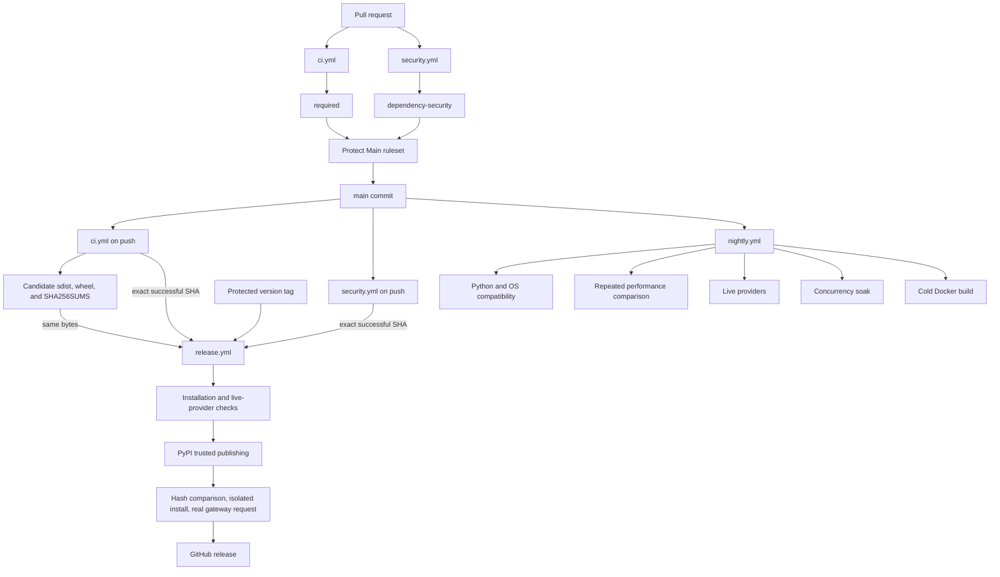
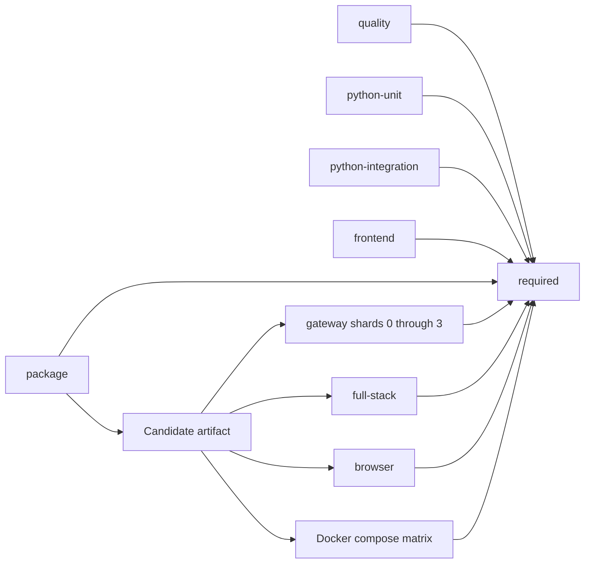

# Continuous integration design

This document is the source of truth for airmux automation. It explains the workflow topology, the artifact and trust
boundaries, the stable merge gates, and the invariants that a CI change must preserve. The workflow files remain the
executable definition; this record explains why they have their current shape and how to change them safely.

## Goals and invariants

- Every pull request and every commit on `main` runs the complete correctness graph
- Correctness jobs have no path filters, semantic change map, or conditional skip
- Branch protection depends only on the stable `required` and `dependency-security` aggregate checks
- The Python distribution is built once per correctness run and every black-box job tests that exact candidate
- The wheel is rebuilt from the source distribution so the source distribution is the packaging source of truth
- Every artifact consumer verifies `SHA256SUMS` before installation or execution
- A release publishes the exact candidate produced by successful CI for the tagged `main` commit
- Untrusted pull-request code never receives provider secrets or release credentials
- Slow, secret-bearing, repeated, and performance-sensitive checks stay outside the pull-request critical path
- Test reports and failure diagnostics survive failed jobs
- Third-party actions are pinned to full commit SHAs and jobs receive only their required permissions

## Automation topology



There are exactly four workflow files:

- [ci.yml](../../.github/workflows/ci.yml) runs for pull requests, `main` pushes, and manual dispatches; it owns
  correctness, packaging, installed-candidate acceptance, and evidence, with `required` as its stable result
- [security.yml](../../.github/workflows/security.yml) runs for pull requests, `main` pushes, weekly schedules, and
  manual dispatches; it owns dependency audits and review, with `dependency-security` as its stable result
- [nightly.yml](../../.github/workflows/nightly.yml) runs daily or for a manually selected full `main` SHA; it owns
  compatibility, performance, live-provider, soak, and cold-build checks
- [release.yml](../../.github/workflows/release.yml) runs manually for a protected tag from `main`; it verifies,
  publishes, verifies the registry, and then announces the release

Adding another workflow is an architectural change. Prefer adding a job to the workflow that already owns the trust and
latency class. `tests/ci/test_merge_policy.py` intentionally asserts that these are the only workflow files.

## Pull-request and main correctness graph

`ci.yml` uses the same graph for pull requests and `main`. The jobs that do not consume the distribution start
immediately. Black-box jobs wait only for `package`, so frontend duration does not delay browser acceptance.



| Job | Contract |
| --- | --- |
| `quality` | Workflow validation, formatting, lint, typing, import boundaries, generated artifacts, audits, and CI/documentation tests |
| `python-unit` | Contract, control-plane unit, data-plane, CLI, and model-audit suites with no Docker access |
| `python-integration` | Postgres-backed control-plane integration tests |
| `frontend` | Console and generated-client lint, typing, coverage, and console build |
| `package` | One source distribution, a wheel rebuilt from it, metadata validation, and SHA-256 evidence |
| `gateway` | Installed-candidate gateway and installation acceptance split over four runners with Docker disabled |
| `full-stack` | Installed-candidate control-plane and data-plane scenarios |
| `browser` | Real Chromium behavior against the installed candidate |
| `docker` | Compact and split Compose deployments built from the candidate |
| `required` | `always()` aggregate that rejects every result other than success |

The aggregate job uses runner-provided `jq` against `toJSON(needs)`. Its name is deliberately stable. Branch protection
does not list matrix-expanded or implementation job names, so the graph can evolve without weakening the merge gate or
requiring a ruleset update for every rename.

## Candidate artifact contract

`scripts/build-python-distribution.sh` builds the source distribution. `package` then asks `uv` to build the wheel from
that archive and writes both digests to `candidate/SHA256SUMS`. The upload action's artifact ID is passed to consumers,
which prevents a same-name artifact from another run from being selected accidentally.

The [install-candidate action](../../.github/actions/install-candidate/action.yml):

1. Downloads that artifact ID into `candidate`
2. Exports constraints from the locked workspace
3. Verifies `SHA256SUMS`
4. Installs the candidate wheel into an isolated `uv tool` directory
5. Exposes `AIRMUX_INSTALL_BIN` and `AIRMUX_GATEWAY_BIN`

Tests may import the checkout for test harness code, but black-box execution uses the installed binary. Pull-request
candidates are retained for seven days and `main` candidates for thirty days because releases consume the latter.

## Gateway sharding

The gateway suite is collected normally, then `tests/acceptance/gateway/gateway_sharding.py` assigns every pytest node
ID to `sha256(nodeid) mod 4`. Each matrix runner selects one shard and reports all other collected items as deselected.
This has four useful properties:

- Every collected correctness test belongs to exactly one runner
- Assignment is deterministic across reruns
- Adding or parameterizing a test needs no workflow edit
- Local pytest behavior is unchanged when `--shard` is absent

Each shard still uses `pytest-xdist -n auto` within its runner. Performance-marked tests are excluded from correctness
and validated by nightly. Shard zero also owns the portable and integration installation suites. The hash balances test
count, not measured runtime; change the shard count only after using Actions timing data to show that the critical path
benefits.

## Evidence and failure behavior

Pytest jobs write JUnit XML. `tests/acceptance/gateway/ci_report.py` reads those reports in an `always()` step, adds a
job summary, and emits GitHub error annotations for the first ten failures. The reporter never changes pytest's exit
status. Result and diagnostic uploads also use `always()` with `continue-on-error` so evidence handling cannot replace
the original failure.

| Evidence | Retention |
| --- | ---: |
| Pull-request and routine test results | 7 days |
| Successful `main` candidate | 30 days |
| Release candidate copied into a release run | 30 days |
| Repeated performance measurements | 90 days |

Gateway, full-stack, provider, browser, and deployment harnesses retain scenario logs only when configured through
their artifact environment variable. Secrets are redacted before Docker logs are uploaded.

Parallel Python jobs can produce a successful-run warning such as `Unable to reserve cache ... another job may be
creating this cache`. All jobs share the same `setup-uv` key, so one job saves the cache and concurrent writers lose the
reservation. This is benign cache contention, not a test warning. Do not serialize the correctness graph or create
duplicate per-job caches merely to hide that annotation.

## Security workflow and repository policy

`security.yml` exports the locked Python dependency graph to `pip-audit`, runs `bun audit`, and uses GitHub dependency
review when Advanced Security is available. Private repositories without that feature retain both ecosystem audits as
the free-tier fallback. `dependency-security` accepts a skipped dependency-review job on events where it cannot run,
but it always requires both ecosystem audits to succeed.

Repository-owned policy is recorded under `.github/policy/`:

- `protect-main.json` requires a current base, linear history, resolved conversations, squash merging, `required`, and `dependency-security`
- `actions.json` restricts actions and requires full-SHA pins
- `security.json` records CodeQL default setup, secret scanning, and push protection
- Release tag files make `v*` creation deliberate and existing tags immutable
- `release-environment.json` constrains secret-bearing and publishing jobs

`scripts/github-policy diff` is read-only and compares those files with live GitHub settings. `scripts/github-policy
apply` is the explicit mutation path. Workflow YAML cannot enforce repository settings by itself.

## Nightly ownership

Nightly accepts only a full commit SHA that is an ancestor of `origin/main`, then builds its own candidate for that SHA.
It owns checks that are too slow, noisy, platform-expensive, or secret-bearing for pull requests:

- Python 3.13 and 3.14 portable installation on Linux and macOS
- Five-round performance comparison with the preceding `main` revision and 90-day raw evidence
- Real OpenAI and Anthropic provider acceptance through the protected `release` environment
- Three repetitions of concurrency, disconnect, and reload scenarios
- A no-cache Docker build followed by deployment acceptance

Performance changes begin as report-only warnings. Investigate the raw rounds and direct-upstream measurements before
treating one as a gateway regression. Nightly jobs never execute pull-request revisions.

## Release chain of custody

Release is manually dispatched from `main` with an existing protected tag. `prepare` validates the tag shape, resolves
it to an immutable commit, proves that commit belongs to `main`, and checks that the package version matches the tag.
It then queries GitHub by workflow identity and exact SHA for successful `required` and `dependency-security` jobs from
trusted `main` push runs.

The workflow downloads the candidate from that exact CI run and verifies its digests. It does not rebuild. Installation
and live-provider jobs test those bytes without shared caches. Publishing uses PyPI trusted publishing with OIDC and
the narrow `id-token: write` permission. After upload, the workflow downloads the registry artifacts, compares their
hashes with the candidate, installs the verified wheel into an empty tool environment, and sends a real gateway
request. The GitHub release is created only after all of those checks succeed.

This ordering prevents a green source checkout from masking a broken distribution, a registry mutation, or a package
that cannot serve a request after installation.

## Changing CI safely

Before changing the graph, identify which class owns the check:

| Check characteristic | Owner |
| --- | --- |
| Deterministic correctness required before merge | `ci.yml` |
| Dependency or supply-chain safety | `security.yml` |
| Slow, repeated, cross-platform, performance, soak, or secret-bearing | `nightly.yml` |
| Publish and post-publish chain of custody | `release.yml` |

Preserve these rules while editing:

- Add suites by directory or marker discovery, not hand-maintained test-file matrices
- Keep `required` and `dependency-security` stable and update their complete `needs` sets
- Feed every installed-artifact test from `package`
- Never rebuild inside a consumer or release job
- Keep diagnostics in `always()` steps without allowing them to mask the primary result
- Pin every third-party action by full SHA
- Keep permissions read-only by default and grant writes on the smallest job
- Update this record, the workflow contract tests, and `.github/policy` when their behavior changes

Run the focused contracts before pushing:

```bash
uv run --no-sync pytest tests/ci tests/workflows tests/documentation
uv run --no-sync pytest tests/acceptance/gateway/test_ci_report.py tests/ci/test_gateway_sharding.py
./scripts/github-policy diff
```

The live policy diff requires authenticated repository access and is intentionally not part of ordinary local tests.
The pull-request `quality` job independently downloads and runs `actionlint` with ShellCheck integration.

## Operational targets

Track pull-request required-check p50 and p95, queue p95, infrastructure failure rate, `main` green rate, retries, and
missing-test incidents weekly. The targets are:

- Required-check p50 under four minutes
- Required-check p95 under six minutes
- Queue p95 under one minute
- Infrastructure failures below 0.5 percent
- `main` green rate above 99 percent
- Zero retries needed for a green result
- Zero missing-test incidents

Record exceptions in this document after enough runs exist to make the percentiles meaningful.
