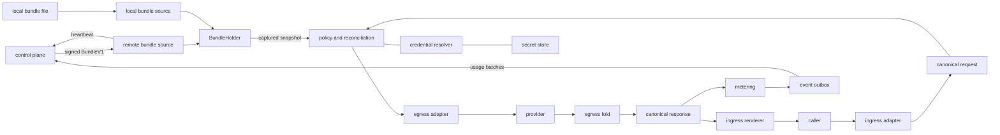

# Data plane design

This document is the source of truth for the implemented data plane. It describes the public HTTP
surface, internal architecture, runtime behavior, configuration, extension points, and current
limitations. It is a developer document, not a rebuild plan or roadmap.

The committed schemas under `taxonomy/schemas/completion/` are the normative canonical request,
response, and stream shapes. This document explains how those shapes move through the system and how
the compatibility surfaces relate to them.

## Role and boundaries

The data plane is the request-serving half of the gateway. It authenticates inference callers,
selects a catalog entry and provider credential from an immutable bundle, translates between caller
and provider protocols, proxies the upstream request, and records usage. It does not own management
state and never queries the management database.

Its hard boundaries are architectural, not conventions:

- `data_plane` never imports `control_plane`, SQLAlchemy, SQLModel, asyncpg, Alembic, or FastAPI
- `contract` is the only code shared by the two planes
- Every fact needed for authentication, policy, provider selection, reconciliation, and pricing is in `BundleV1`
- A feature that appears to require a database read on the request path requires a bundle field instead
- `evaluate()` remains pure and synchronous, with no I/O, clock access, or hidden state
- Starlette is the HTTP framework; Pydantic validation is applied deliberately at protocol boundaries

The request path performs no control-plane or database I/O. It can still perform three kinds of I/O:

- A provider-secret store read on a credential cache miss
- The provider HTTP request
- A synchronous local SQLite write when the durable event outbox is enabled

The high-level data flow is:



The caller dialect and provider family are independent. An Anthropic Messages caller can be served
by an OpenAI-compatible provider, and an OpenAI SDK caller can be served by an Anthropic provider.
Both cross the same canonical middle.

## Public HTTP contract

### Routes

| Route | Behavior |
|---|---|
| `POST /v1/chat/completions` | Canonical completion surface with OpenAI-compatible ingress detection |
| `POST /v1/messages` | Anthropic Messages surface |
| `GET /healthz` | Liveness, always `200` while the process can answer HTTP |
| `GET /readyz` | `200` when this worker holds a bundle snapshot, otherwise `503` |

The health routes require no authentication. Readiness means only that a bundle has been admitted.
It does not prove that the control plane, secret store, event exporter, or any upstream provider is
currently reachable.

### Authentication

Inference routes require `Authorization: Bearer sk-inf-...`. The bearer is an opaque inference key
minted by the control plane, or declared as plaintext in a trusted local bundle. The data plane:

1. Captures the worker's current `BundleSnapshot`
2. Rejects with `503 bundle_unavailable` if no snapshot exists
3. Verifies the `sk-inf-` prefix
4. Hashes the presented token and looks it up in the snapshot's key index

The bundle contains only token hashes. Revocation is absence from a later bundle, so a request made
after the new bundle is admitted fails without a database or cache invalidation call.

On `/v1/chat/completions`, authentication and JSON decoding happen before dialect resolution. An
error at either stage therefore uses the canonical error envelope. `/v1/messages` binds the
Anthropic ingress before those checks, so every error on that route is Anthropic-shaped.

### Canonical request

The canonical request is `CanonicalRequest` and is published as `airllm.request.yaml`. Its modeled
fields are:

- `model`, `messages`, and `stream`
- `max_tokens`, `temperature`, `top_p`, `stop`, and `seed`
- `tools`, `tool_choice`, and `response_format`

A minimal canonical call is:

```bash
curl http://127.0.0.1:8080/v1/chat/completions \
  -H 'Authorization: Bearer sk-inf-...' \
  -H 'Content-Type: application/json' \
  -H 'x-airllm-dialect: canonical' \
  -d '{"model":"gpt-4o-mini","messages":[{"role":"user","content":"hello"}]}'
```

Messages contain typed parts rather than provider-specific blocks:

- `text`
- `image`, by URL or base64 data plus media type
- `reasoning`, optionally carrying an opaque provider signature
- `tool_call`, with arguments retained as JSON text
- `tool_result`, represented as a user-message part

Role validation is part of the type. System messages carry text, user messages carry text, images,
or tool results, and assistant messages carry text, reasoning, or tool calls. A plain string is
accepted as shorthand for one text part and normalized at parse time.

The request top level is open. Unknown top-level fields become canonical extras so a caller can use
provider-specific parameters through the gateway. Nested shapes are closed because an unknown field
inside a message, part, or tool has no faithful generic translation.

### Canonical response

The canonical response is `CanonicalResponse` and is published as `airllm.response.yaml`. It carries:

- `id` and the caller-facing `model`
- Typed assistant `content`
- `finish_reason`
- Provider-reported or estimated `usage`
- `gateway.adjustments`

Usage includes total input tokens, output tokens, cache-read input tokens, cache-write input tokens,
and whether the counts were estimated. Cache traffic is included in total input tokens.

`gateway.adjustments` reports the request changes made by ingress parsing or reconciliation. Each
entry identifies the parameter, an action of `clamped`, `emulated`, or `dropped`, and a human-readable
reason. The rest of the response remains completion data and does not expose provider-specific state.

Canonical buffered responses and chunks omit null-valued fields. Compatibility renderers follow
their dialect's native wire shape.

### Canonical streaming

A canonical request with `stream: true` receives `text/event-stream`. Each data frame contains one
`CanonicalChunk` from `airllm.stream.yaml`:

- Ordinary chunks carry one typed `text`, `reasoning`, or `tool_call` delta
- Tool-call fragments use an index; the opening fragment carries the id and name, and argument text accumulates across fragments
- The closing chunk has no delta and carries finish reason, usage, and gateway adjustments
- The stream terminates with `data: [DONE]`

If an error occurs after the HTTP stream has opened, the status is already committed. The error is
rendered as an SSE event in the caller's dialect. Canonical and OpenAI streams then emit `[DONE]`;
Anthropic streams emit an Anthropic error event.

### OpenAI compatibility on `/v1/chat/completions`

The chat route supports both the canonical shape and unmodified OpenAI SDKs. `resolve()` selects the
ingress adapter in this order:

1. A recognized `x-airllm-dialect` override
2. Each non-canonical adapter's `claims()` result in registry-name order
3. Canonical as the unclaimed default

The recognized override values are `canonical`, `openai_native`, and `anthropic`. Anthropic clients
normally use `/v1/messages`, which binds that ingress directly. An unrecognized override is ignored,
after which claims and canonical fallback proceed normally.

The OpenAI ingress claims a request when either condition is true:

- `User-Agent` begins with `OpenAI/`, as the official SDK sends
- The body has an unambiguous OpenAI marker: a `tool` or `developer` role, `tool_calls`, an
  `image_url` block, a nested `function` wrapper, or `max_completion_tokens`

The `x-stainless-*` headers are not used for detection because other vendors also ship
Stainless-generated clients. A text-only request without a fingerprint or override is shape-identical
to canonical and therefore receives the canonical response.

An OpenAI request is parsed into canonical and rendered back as OpenAI:

- Buffered responses use `chat.completion` and the `choices` axis
- Streamed responses use `chat.completion.chunk`, finish with a usage-only chunk, and then `[DONE]`
- `gateway` is an extra field that official SDK models retain or ignore safely
- OpenAI-shaped errors are returned after the dialect has been resolved

Pointing the official client at the gateway changes only its base URL and key:

```python
from openai import OpenAI

client = OpenAI(base_url="http://127.0.0.1:8080/v1", api_key=inference_key)
completion = client.chat.completions.create(
    model="gpt-4o-mini",
    messages=[{"role": "user", "content": "hello"}],
)
```

### Anthropic compatibility on `/v1/messages`

The Messages route binds `AnthropicIngress` directly. Buffered responses, named SSE events, usage,
tool blocks, thinking blocks, signatures, stop reasons, and errors are rendered in Anthropic's
shape regardless of the upstream provider family. `gateway` is an extra field on the buffered
message and on the stream's usage-bearing `message_delta` event.

The Anthropic SDK needs its normal `api_key` argument for construction, but the gateway bearer is
passed as `auth_token`:

```python
from anthropic import Anthropic

client = Anthropic(
    base_url="http://127.0.0.1:8080",
    api_key="unused",
    auth_token=inference_key,
)
message = client.messages.create(
    model="claude-sonnet-4-6",
    max_tokens=256,
    messages=[{"role": "user", "content": "hello"}],
)
```

Anthropic request fields not consumed by the ingress, such as `thinking`, `top_k`, and `metadata`,
become canonical extras. Provider profiles decide whether those extras are forwarded.

### Errors

Before streaming begins, request and transport errors use an HTTP status plus the resolved caller
dialect's error body. The canonical body is `{"error": {"code": "...", "message": "..."}}`.

| Status | Gateway code | Meaning |
|---|---|---|
| `400` | `invalid_request` | The body is not a JSON object or does not parse into the selected ingress |
| `401` | `missing_bearer_token`, `invalid_token` | The caller did not present a live inference key |
| `402` | `credential_unavailable` | No provider credential exists at any eligible scope |
| `404` | `unknown_model` | The requested model is absent from the bundle |
| `502` | `provider_not_configured` | The model points to a provider absent from the bundle |
| `502` | `credential_missing` | The selected credential has no value in the secret store |
| `502` | `upstream_unreachable`, `upstream_error` | The provider could not be reached or failed |
| `502` | `invalid_upstream_response` | The provider response violated its protocol |
| `503` | `bundle_unavailable` | No bundle has been admitted |
| `503` | `credential_backend_unavailable` | The secret store could not answer |
| `504` | `upstream_timeout` | The provider timed out |

Provider HTTP statuses are preserved. When an adapter recognizes the provider's error body, its code
and message are also preserved and then rendered in the caller's dialect. Error codes are additive;
clients should branch on status class first and code second.

### Compatibility policy

The canonical schemas and their surrounding behavior are the gateway's stable consumer contract:

- Existing fields keep their type and meaning; new fields may appear anywhere
- New content parts, deltas, finish reasons, adjustment actions, gateway members, and error codes may appear
- Callers must treat unknown fields and enum members as unknown rather than failing
- Plain-string message content and the open request top level remain supported
- A canonical response stays provider-neutral; provider identity does not change its top-level shape
- Canonical schema changes land as committed diffs under `taxonomy/schemas/completion/`

## Package structure

| Area | Ownership |
|---|---|
| `main.py` | Typer commands for serving and exporting canonical schemas |
| `app.py`, `runtime.py`, `config.py` | Process composition, lifespan, routes, and immutable runtime dependencies |
| `bundle/`, `cache.py`, `heartbeat.py` | Bundle acquisition, verification, admission, durable cache, and instance heartbeat |
| `canonical/` | Provider-neutral request, response, content, usage, and stream types |
| `ingress/` | Caller-dialect detection, parsing, response rendering, and error rendering |
| `formats/` | Pure JSON spelling shared by ingress and egress for one protocol family |
| `egress/` | Provider-family transport, response parsing, stream folding, and upstream error mapping |
| `auth.py`, `policy.py` | Hash authentication and pure bundle evaluation |
| `credentials.py` | Credential-scope indexing and secret-store resolution |
| `profiles.py`, `reconcile.py` | Precompiled provider facts and request adjustments |
| `metering.py`, `outbox/` | Usage calculation, durable buffering, and control-plane export |
| `proxy.py` | The one request orchestration path shared by all caller and provider combinations |

`formats` exists only when a wire spelling has two consumers. OpenAI and Anthropic formats are used
on both ingress and egress, so their mappings live there. Ingress adapters never import egress
adapters and egress adapters never import ingress adapters.

## Runtime construction and supervision

`airllmdp serve` sets `GW_CONFIG`, optionally enables development mode, and starts Uvicorn. Every
worker process constructs its own application lifespan and therefore owns:

- One `httpx.AsyncClient` shared by bundle polling, heartbeat, event export, and provider calls
- One `BundleHolder`
- One selected `BundleSource`
- One `CredentialResolver` and secret-store instance
- One selected `EventOutbox`
- One frozen `Runtime` exposed through Starlette request state

The HTTP client enables HTTP/2, caps the connection pool, and has explicit connect, read, write, and
pool timeouts. Components receive it at construction; they do not create per-request clients.

Bundle and outbox implementations start their own workers inside one `asyncio.TaskGroup`. Current
task names are `bundle poll`, `heartbeat`, `local bundle reload`, and `event export`.

All periodic work uses `run_periodic()`:

- Declared operational failures are logged and retried after the configured interval
- Any undeclared exception escapes the loop
- A worker that returns or fails unexpectedly logs at critical level and sends `SIGTERM` to its process
- Task-group cancellation stops sibling workers
- Normal shutdown cancels workers, closes the outbox, and closes the shared HTTP client

The process exit is deliberate. A single-process deployment relies on its supervisor to restart it.
Under Uvicorn multi-worker mode, the parent process replaces the failed worker.

### Multi-worker state

Workers configured with the same cache directory cooperate through local files:

| File | Purpose |
|---|---|
| `bundle.json` | Last admitted signed remote bundle, written atomically |
| `instance_id` | Stable logical data-plane id shared by workers and reported in heartbeats |
| `events.db` | SQLite WAL outbox shared by all workers |

Each worker still polls and heartbeats independently. Atomic bundle writes prevent workers from
renaming one another's temporary files. SQLite serializes event writes, and a lease ensures only one
worker exports at a time.

The cache directory is local coordination, not distributed coordination. Replicas on different
hosts have separate caches, instance ids, and outboxes unless the deployment supplies a filesystem
with the required SQLite and atomic-rename semantics.

## Configuration

`Config` is frozen and rejects unknown top-level fields. It contains a discriminated bundle config,
a secret-store config, a discriminated event-outbox config, and the CLI-derived development flag.

There is no global control-plane setting. Each component that uses the control plane owns a complete
`ControlPlaneLink` containing its URL and token. The bundle poller and event exporter may use
different links; the data plane does not validate that they match.

### Remote mode

The checked-in deployment uses a YAML anchor to avoid repeating a shared link:

```yaml
vars:
  cache_dir: .airllm

data_plane:
  bundle:
    kind: remote
    control_plane: &control_plane
      url: ${env:GW_DATAPLANE_CONTROL_PLANE_URL:-http://127.0.0.1:8000}
      token: ${file:${var:cache_dir}/dataplane.key}
    verify_key: ${file:${var:cache_dir}/signing.pub}
    cache_dir: ${var:cache_dir}
    staleness_policy: serve_and_warn
    poll_interval_s: 5

  events:
    kind: sqlite
    control_plane: *control_plane
    cache_dir: ${var:cache_dir}
    flush_interval_s: 5
```

The anchor is YAML reuse only. Both nested configs validate their own complete link, and no equality
constraint is applied after parsing. The omitted secret-store setting defaults to environment
variables.

`RemoteBundleConfig.org` optionally narrows the poll to one organization. Without it, the request is
made without `org_id` and the control plane chooses the latest bundle according to its endpoint
semantics. One worker holds one admitted bundle at a time.

### Local mode

Local mode needs no control plane, signing key, database, heartbeat, or remote bundle cache:

```yaml
data_plane:
  bundle:
    kind: local
    path: bundle.standalone.yml
    reload_interval_s: 2
  events:
    kind: devnull
  secrets:
    kind: env
```

Bundle source and outbox are independent choices. A local bundle can use the SQLite exporter, and a
remote bundle can use `devnull`, because neither choice is inferred from the other.

The config loader reads the `data_plane` section from `GW_CONFIG`, defaulting to `airllm.yml`.
Configuration references support `env:NAME`, `file:PATH`, `${env:NAME}`, `${file:PATH}`, defaults with
`:-`, and `${var:NAME}` substitution from the root `vars` block. A missing unresolved reference
becomes null; required config fields then fail Pydantic validation instead of producing partial
credentials.

`airllmdp serve --dev` sets `GW_DEV=1`, enables local logging, and runs Uvicorn reload mode. Use
`--workers N` outside development for multiple worker processes.

## Bundle acquisition and immutable request state

### What the bundle carries

`BundleV1` is the complete management snapshot required by the data plane:

- Live inference-key hashes with org and workspace ownership
- Providers with adapter kind, base URL, parameter aliases, and extra-parameter policy
- Models with caller id, upstream id, provider, prices, context limits, output limits, and capability declarations
- Provider credential references, scope, priority, and rotation version
- Bundle identity, issue time, expiration time, and organization

Provider credential values are never in the bundle. The bundle is org-sensitive because it contains
live inference-key hashes, but reading it does not reveal the original keys.

### Remote source

Remote startup is designed to serve through a control-plane outage:

1. Read `bundle.json` from the configured cache directory
2. Parse and verify its Ed25519 signature with the configured public key
3. Apply staleness policy and admit it if allowed
4. Start the poll and heartbeat loops

The poller immediately requests `GET /v1/bundle/latest`, unwraps the response envelope, ignores an
already-served bundle id, verifies a changed bundle, admits it, and atomically persists the signed
form. Parse errors, signature failures, HTTP failures, and filesystem failures are recoverable. The
last admitted snapshot remains in service while polling retries.

The heartbeat posts a stable cache-directory instance id, package version, and current bundle id to
`POST /v1/heartbeat`. A null bundle id means the process is alive but not ready.

### Local source

A local bundle file contains plaintext inference tokens plus provider and model entries. Compilation:

- Hashes each inference token into a `KeyEntry`
- Assigns the fixed local org and workspace ids
- Synthesizes one platform-scoped credential reference per provider
- Derives stable secret ids from provider ids and the bundle id from file content
- Produces the same `BundleV1` used by remote mode

The initial file load happens during startup. Later reloads run in a worker thread when the file
modification time changes. A malformed edit is logged and retried while the last good snapshot keeps
serving. The local file is trusted because the operator controls its filesystem; it is not signed and
contains plaintext caller tokens.

With the environment secret store, a synthesized provider ref resolves through the conventional
`{PROVIDER_ID}_API_KEY` environment variable.

### Admission and snapshots

`BundleHolder.admit()` is the only bundle admission point. It:

1. Checks expiration against `staleness_policy`
2. Builds all request-path indexes once
3. Replaces `holder.snapshot` with one new `BundleSnapshot` reference

The snapshot contains the bundle plus key, model, provider, credential, and compiled-profile indexes.
A handler captures one snapshot before reading the request body and uses it for the entire request.
A concurrent bundle swap therefore cannot mix an old key index with a new catalog or price table.

Staleness is checked when a bundle is admitted, not continuously on every request. `serve_and_warn`
admits an expired bundle with a warning. `refuse` rejects it and leaves the previous snapshot intact,
or leaves a cold worker unready if no previous snapshot exists.

## The canonical waist and adapter model

The gateway uses a two-sided adapter model:

```text
N caller dialects -> one canonical completion definition -> M provider families
```

The translation cost is N plus M, not N times M. Policy, credential selection, reconciliation,
metering, and request orchestration operate once on canonical types.

### Ingress adapters

An ingress adapter owns one caller dialect and implements:

- `claims()` for chat-route discrimination
- `parse()` into canonical plus parse-time adjustments
- `render_response()` and `render_error()`
- `new_stream()` for rendering canonical chunks in the caller's stream protocol

Concrete classes are discovered by scanning modules under `ingress/`. Duplicate dialect names fail
startup. Canonical never claims a request; it is the explicit fallback owned by `resolve()`.

### Egress adapters

An egress adapter owns one provider family and implements:

- Canonical request to `UpstreamRequest`
- Buffered upstream response to canonical response
- Provider stream-state construction
- Wire-event framing and synchronous event folding
- Terminal-stream validation and prefix-safe finalization
- Provider error to canonical error mapping

Concrete classes are discovered by scanning modules under `egress/`. Duplicate kinds fail startup.
The bundle's `ProviderEntry.kind` selects the class, and the per-request provider entry and resolved
secret are injected into its constructor.

Current egress families are `openai_compatible` and `anthropic`. Their adapters own endpoint paths,
authentication headers, response parsing, and stream semantics. A provider that differs only in
base URL, parameter spelling, or accepted extras remains in the existing family and is configured in
the catalog rather than implemented as another adapter.

### Shared format modules

`formats/openai.py` and `formats/anthropic.py` contain pure, hand-written mappings for the JSON
spelling shared by both sides. They have no URLs, credentials, or I/O. Every canonical field is
mapped explicitly; matching field names across protocols are not treated as proof of equivalent
meaning.

## Request execution

All caller/provider combinations use the same orchestration in `proxy.py`:

1. Capture the current bundle snapshot and authenticate the bearer
2. Read a JSON object and resolve or bind the ingress dialect
3. Parse the caller body into `CanonicalRequest` and collect translation adjustments
4. Call pure `evaluate()` with the request, authenticated key, and captured snapshot
5. Select the first credential candidate from the most specific populated scope
6. Resolve that credential through the configured secret store
7. Create `Ctx` with request, bundle, caller, provider, model, and credential attribution
8. Reconcile the request with the model limit and compiled provider profile
9. Construct the egress adapter and transform the request by hand
10. Call the provider through the worker's shared HTTP client
11. Parse or fold the provider response back into canonical
12. Record usage and render the canonical result in the original caller dialect

The response always names the caller-facing model id. The upstream model id is an egress detail.

### Pure policy

`evaluate()` currently answers four questions with snapshot lookups:

- Does the requested model exist
- Does its provider exist
- Which credential tier is eligible
- Which compiled provider profile applies

It returns `Deny` for an unknown model, missing provider, or absent credential tier. Otherwise it
returns `Allow` with the model, provider, ordered credential candidates, and profile. It does not do
I/O or select based on mutable provider health.

### Credential scope and resolution

Credentials are indexed by provider at three scopes. Resolution chooses the first non-empty tier:

1. Workspace
2. Organization
3. Platform

Entries within a tier are ordered by ascending priority and then name. A populated narrow tier never
falls through to a broader account because its value is missing or its store is unavailable. Such a
fallback would silently move tenant spend onto somebody else's credential.

Request execution currently uses only the first candidate in the selected tier. Its value is cached
by `(secret_id, version)` for five minutes, with missing values cached for 15 seconds. A bundle
rotation bumps `version` and therefore bypasses the old cache immediately. Concurrent cold requests
for one key use a per-key single-flight lock. Secret-store unavailability is never cached.

### Reconciliation and provider profiles

Provider profiles are compiled when a bundle is admitted. They describe:

- Canonical parameter aliases, such as `max_tokens` becoming `max_completion_tokens`
- Extra parameters accepted by a closed provider schema
- Whether unknown extras are accepted or rejected by that provider

Reconciliation applies those facts before egress:

- Unknown top-level extras are forwarded for open providers
- A closed provider receives only its declared extras
- An extra that collides with an aliased canonical field is dropped
- `n` is always dropped because the canonical response represents one completion
- `max_tokens` is clamped to the model's `max_output_tokens`

Every drop or clamp becomes a gateway adjustment. Egress rendering merges surviving extras with the
typed provider body, with typed fields winning collisions.

## Streaming internals

Provider streaming has three layers with deliberately separate ownership:

1. The HTTP transport yields arbitrary byte chunks and never parses SSE
2. `frame_sse()` performs the shared SSE state machine and emits `RawEvent`
3. The egress adapter interprets provider events, emits canonical chunks, and folds response state

`frame_sse()` handles CRLF variants, split lines, comments, named events, multiline data, and event
reset. OpenAI adds only its `[DONE]` sentinel. Anthropic consumes the shared named-event output.

`frame()` and `transform_stream_event()` are synchronous so a recorded byte log can be folded without
network or asyncio. Network chunk boundaries are arbitrary, and tests run every adapter against
adversarial split sizes.

Each adapter creates its own `StreamState`. `finalize(state)` must return a valid
`CanonicalResponse` at every prefix, including before a complete SSE line arrives. This invariant is
what makes cancellation accounting possible.

`StreamSession` opens the upstream response inside an async exit stack, then hands ownership of that
stack to the `StreamingResponse` iterator. The provider connection therefore remains open for the
life of the downstream stream and closes on completion, error, or disconnect.

On a normal end, the adapter validates the provider's terminal event, finalizes accumulated state,
the ingress renderer emits its closing frames, and usage is recorded as `ok`. A malformed event,
provider error event, HTTP read failure, or missing terminal event becomes a dialect-shaped stream
error and an `upstream_error` or `timeout` usage event. A client disconnect finalizes the partial
state, estimates missing usage, records `cancelled`, and re-raises cancellation.

## Metering and event delivery

Metering uses provider counts whenever the adapter recognizes them. When counts are absent or a
stream ends early, tiktoken estimates prompt and emitted text tokens. The model's bundle entry prices:

- Fresh input tokens
- Cache-read input tokens
- Cache-write input tokens
- Output tokens

Every emitted `UsageEventV1` carries the request, org, workspace, key, model, provider, bundle,
credential, scope, status, token counts, cost split, stream flag, and latency. Current statuses are
`ok`, `upstream_error`, `denied`, `timeout`, `cancelled`, `credential_rejected`, and `rate_limited`.
The control plane uses `ok`, `credential_rejected`, and `rate_limited` events to update observed
credential health. That health does not currently feed back into data-plane selection.

Policy denials after authentication and parsing produce zero-token `denied` events. Provider calls,
provider failures, protocol failures, timeouts, and stream cancellations are also metered. Failures
before policy, plus missing or unavailable secret values, currently do not produce usage events.

### SQLite outbox

`SqliteOutbox.record()` performs a local transaction and `INSERT OR IGNORE` keyed by `event_id`. It
does no network work. The export loop:

1. Acquires or renews the single-row lease
2. Reads up to 1,000 events in insertion order
3. Posts them to `POST /v1/events`
4. Deletes those event ids only after a successful HTTP response

For committed rows, delivery is at least once. A crash after control-plane ingestion but before local
acknowledgement can replay the batch; the control plane upserts on `event_id`, making ingestion
idempotent. A control-plane outage leaves requests serving and events accumulating on disk until
export succeeds.

`DevNullOutbox` discards events and starts no worker. It is intended for standalone development,
load tests, or deployments that meter elsewhere.

## Changing or extending the data plane

### Add a provider in an existing family

Prefer catalog data over code when the provider shares a current family's endpoint and authentication
conventions:

1. Add the provider and models to taxonomy
2. Set `kind`, `base_url`, aliases, `accepted_params`, and `params_closed`
3. Apply taxonomy and compile a new bundle
4. Prove the actual upstream body and response through a running data plane

No data-plane registry or adapter edit is needed for spelling-only differences.

### Add an egress family

1. Add one module under `egress/`
2. Subclass `EgressAdapter` and set a unique `kind`
3. Implement buffered request/response mapping, error mapping, stream state, framing, folding, validation, and prefix-safe finalization
4. Put shared JSON spelling in `formats/<family>.py` only if ingress also consumes it
5. Add the family to the shared provider contract and catalog schema if the closed `ProviderEntry.kind` type does not yet allow it
6. Add one recorded buffered and streaming corpus for the family

Discovery requires no registry edit. The current closed `ProviderEntry.kind` literal is a separate
contract constraint and is the reason a genuinely new family still needs a shared-contract change.

### Add an ingress dialect

1. Add one module under `ingress/`
2. Subclass `IngressAdapter` and set a unique `dialect`
3. Make `claims()` answer only whether the request is unmistakably that dialect
4. Parse into canonical and report translation loss as adjustments
5. Render buffered responses, errors, and streams from canonical
6. Reuse a format module when the same protocol is already an egress family

Do not edit a registry. `resolve()` owns override handling, claims ordering, and canonical fallback.
A dedicated route requires an explicit route binding in `app.py`; a chat-route dialect does not.

### Change the canonical definition

A canonical change affects every caller and provider family:

1. Change the typed definition in `canonical/completion.py`
2. Map the field or part by hand in every relevant format
3. Decide explicit reject, adjustment, or support behavior for families that cannot carry it
4. Add the case to the shared canonical corpus
5. Run `uv run airllmdp schema` and review the committed schema diff
6. Prove buffered and streamed behavior where applicable

Never replace explicit mappings with reflection. A shared field name is not a protocol guarantee.

### Add policy state

If policy needs a fact not already in the snapshot:

1. Add it to the shared bundle contract
2. Populate it in the control-plane compiler or local compiler
3. Precompute any lookup structure in `BundleSnapshot.from_bundle()`
4. Consume it synchronously in `evaluate()` or reconciliation

Do not add a control-plane call, database client, or async branch to `evaluate()`.

### Add background behavior

The implementation that owns the behavior owns its task. Return named tasks from its `start()`
method, declare only genuinely recoverable failures in `run_periodic()`, and let programming errors
escape so process supervision can act. Do not add optional no-op dependencies to the application
composition root.

## Testing and verification

The data-plane suite is organized around behavior and boundaries:

- Canonical corpus tests cover typed conversations and generated-schema drift
- Ingress tests use official SDK models to validate compatibility surfaces
- Egress request tests validate rendered bodies against reference provider schemas
- Adapter tests are parameterized over every discovered adapter
- Streaming tests fold recorded byte logs across adversarial chunk boundaries and finalize every prefix
- Request-path tests assert observable HTTP, upstream, and outbox behavior
- Boundary tests prove forbidden plane and database modules are not imported
- Acceptance tests launch real control plane, data plane, Postgres, and stub-provider processes

The black-box acceptance suite proves control-plane outage and cold restart, event replay,
multi-worker event safety, local mode, staleness policy, SDK compatibility, provider profiles,
stream cancellation accounting, and malformed upstream handling.

Run the relevant checks from the repository root:

```bash
uv run pytest apps/data-plane/tests
uv run pytest tests/acceptance
uv run ruff format --check .
uv run ruff check .
uv run ty check
uv run lint-imports
```

A unit test is not final proof of a request-path change. Run a real request against a running data
plane and inspect the caller response, upstream request, and usage event relevant to the change.

## Current limitations and non-goals

These are properties of the current implementation, not promises that another layer handles them:

- A model maps to one provider entry; there is no deployment ranking, provider failover, or retry policy
- Policy returns ordered credential candidates, but request execution uses only the first candidate
- Provider `401` and `403` responses are metered as `credential_rejected` but do not currently trigger another candidate or automatic cache eviction
- Model `capabilities` and `context_window` are bundle data but are not enforced on the request path
- Reconciliation clamps only `max_tokens` and governs unknown top-level extras
- Core-field support is not yet symmetric across egress families; for example Anthropic egress
  does not render canonical `seed` or `response_format`, and those losses are not adjustments
- OpenAI egress does not replay canonical reasoning parts in prior messages
- Staleness is evaluated on bundle admission, not continuously after admission
- One worker holds one bundle snapshot at a time; this is not a multi-bundle router
- `readyz` reports bundle presence only
- Local mode synthesizes one platform credential per provider and trusts plaintext inference keys on disk
- SQLite durability and leasing coordinate processes on one compatible filesystem, not a distributed cluster

These limits should be removed by extending the canonical, bundle, policy, or adapter designs in their
own layer. They are not reasons to bypass the canonical waist or introduce control-plane state on the
request path.

## Review checklist

Before merging a data-plane change, verify:

- The change respects the plane boundary and shares only `contract`
- Every request-path fact comes from the captured snapshot or explicit runtime dependencies
- `evaluate()` remains pure, synchronous, and under 100 lines
- Caller and provider protocols meet only through canonical types or a shared pure format module
- Every provider field is mapped deliberately
- Translation loss is rejected or reported, not silent
- The transport does not parse provider SSE
- Stream finalization remains valid at every prefix
- Event recording performs no network work
- Component configs contain their own required dependencies
- Discovery needs no registry edit and rejects discriminator collisions
- Tests assert behavior, and a real running request proves the change
